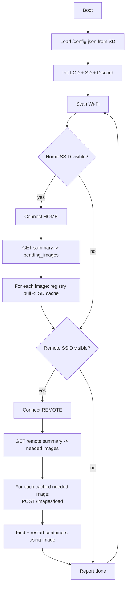

# DockerGo — Sneakernet Docker Updater on LILYGO T‑Dongle‑S3

A USB‑stick sized ESP32‑S3 device that pre‑downloads Docker images on a
high‑bandwidth "home" network and physically carries them to low‑bandwidth
remote sites, where it uploads the images to the local Docker daemon and
restarts the affected containers. All activity is reported on the on‑board
LCD and (optionally) to a Discord webhook.

> Think of it as **sneakernet for container updates**: download at home, walk
> the dongle to a remote site, apply the update over local Wi‑Fi.

---

## 1. Hardware target

**Board:** LILYGO T‑Dongle‑S3 (ESP32‑S3, USB‑A male plug form factor)

| Component        | Detail                                                            |
| ---------------- | ----------------------------------------------------------------- |
| MCU              | ESP32‑S3 (dual‑core Xtensa LX7 @ 240 MHz, Wi‑Fi b/g/n + BLE)       |
| Flash            | 16 MB                                                              |
| PSRAM            | Board‑dependent — treated as **optional** (design fits in SRAM)   |
| Display          | 0.96" ST7735 IPS LCD, 80×160, SPI                                 |
| Storage          | microSD (TF) card via **SD_MMC** 1‑bit mode                       |
| RGB LED          | APA102                                                             |
| Button           | GPIO0 (BOOT)                                                       |
| Power/Data       | USB‑A male (plugs directly into a host/charger)                   |

### Default pin map (`src/pin_config.h`)

These match LILYGO's published T‑Dongle‑S3 pinout. **Verify against your board
revision** before flashing.

| Function        | GPIO |
| --------------- | ---- |
| TFT MOSI (SDA)  | 3    |
| TFT SCLK (SCL)  | 5    |
| TFT CS          | 4    |
| TFT DC          | 2    |
| TFT RST         | 1    |
| TFT Backlight   | 38   |
| SD_MMC CLK      | 14   |
| SD_MMC CMD      | 16   |
| SD_MMC D0       | 17   |
| Button          | 0    |
| APA102 DATA     | 40   |
| APA102 CLK      | 39   |

---

## 2. Framework & toolchain

- **PlatformIO** + **Arduino‑ESP32** core.
- Display: `TFT_eSPI` (configured entirely via `platformio.ini` build flags —
  no `User_Setup.h` editing).
- JSON: `ArduinoJson` v7.
- TLS: `WiFiClientSecure` + the built‑in Mozilla CA bundle (`esp_crt_bundle`).
- SD: `SD_MMC` (built into the core).
- Gunzip: vendored single‑file **miniz** (`lib/miniz`) for streaming inflate.
- SHA‑256: mbedTLS (`mbedtls/sha256.h`, built in) for digest verification.

---

## 3. Requirements (interpreted)

The original request had a small inconsistency ("3 pieces" vs "4 pieces of
info"). This is the interpretation the implementation follows — **correct any
assumption here and the config schema will follow.**

### 3.1 Site model

There is a list of **sites**. Exactly one site is flagged `home: true`. Every
site (home and remote) carries **four** pieces of information:

1. **Wi‑Fi AP** (SSID)
2. **Wi‑Fi password**
3. **Docker API endpoint** — host + port for the insecure daemon API
   (typically `2375`)
4. **Summary / update API** — a custom HTTP endpoint (e.g.
   `http://…:10000/summary`) that reports which images that site currently
   needs (`docker_updater.pending_images`).

### 3.2 Behaviour

1. **On power‑up**, scan for Wi‑Fi. The **home** site is the preferred network.
2. **At home** (good bandwidth): call **every** site's summary API, read each
   `pending_images`, and **download the union** of all needed images from their
   registries to the SD card. This bandwidth‑heavy phase runs where bandwidth is
   good; each site reports its own distinct needs.
3. **At a remote site** (its SSID is visible): connect, call that site's summary
   API to learn what it needs, and for every needed image already cached on SD:
   - **Upload** the image to the local daemon (`POST /images/load`).
   - **Recreate** the container(s) using that image so they run the new image
     (stop → remove → create with the same config → start).
4. **Multi‑network priority:** if both home and a remote SSID are in range,
   **do home first** (download/refresh the cache), then switch to the remote
   site and apply updates.
5. **Status everywhere:** verbose, human‑readable status on the LCD
   ("Connecting to HOME", "Downloading frigate 42%", "Uploading to SITE‑B",
   "Restarting home‑assistant"…) and optional mirrored updates to a **Discord
   webhook**.

### 3.3 Summary API response shape

```json
{
  "status": "ok",
  "checks": {
    "docker_updater": {
      "status": "ok",
      "pending_updates": 7,
      "pending_images": [
        "ghcr.io/liquidguru/docker-updater:latest",
        "ghcr.io/blakeblackshear/frigate:stable",
        "docker.io/nousresearch/hermes-agent:latest",
        "ghcr.io/home-assistant/home-assistant:stable",
        "pihole/pihole:latest",
        "lscr.io/linuxserver/unifi-network-application:latest",
        "docker.io/library/mongo:7.0"
      ]
    }
  }
}
```

Only `checks.docker_updater.pending_images` is required by DockerGo; other keys
are ignored (but may be surfaced on the LCD for context).

---

## 4. Configuration

Config lives on the **SD card** as `/config.json` (human‑editable). A template
ships at `data/config.example.json`. Secrets (Wi‑Fi passwords, Discord URL)
never live in source control.

```jsonc
{
  "device_name": "dockergo-01",
  "image_platform": "linux/amd64",     // manifest-list platform selector
  "discord_webhook": "https://discord.com/api/webhooks/…",  // optional
  "sites": [
    {
      "name": "HOME",
      "home": true,
      "ssid": "HouseNet",
      "password": "…",
      "docker_api": "http://192.168.1.10:2375",
      "summary_url": "http://localmonitoring.house.mayberry.farm:10000/summary"
    },
    {
      "name": "SITE-A",
      "ssid": "SiteA-AP",
      "password": "…",
      "docker_api": "http://10.0.0.2:2375",
      "summary_url": "http://10.0.0.2:10000/summary"
    }
    // … up to N remote sites
  ]
}
```

Notes:
- `home` defaults to `false`. Exactly one site should set `home: true`; if none
  do, the first site is treated as home.
- `image_platform` may be overridden per‑site.
- All target sites are Intel i7, so `image_platform` is `linux/amd64`.

---

## 5. Architecture



### 5.1 Module map (`src/`)

| Module            | Responsibility                                                    |
| ----------------- | ----------------------------------------------------------------- |
| `pin_config.h`    | Board pin constants                                               |
| `app_config`      | Config structs + load/validate `/config.json`                     |
| `status_display`  | LCD status lines, scrolling log, progress bar, LED                |
| `wifi_manager`    | Scan, prioritized connect, RSSI, disconnect                       |
| `summary_client`  | GET summary endpoint, parse `pending_images`                      |
| `image_store`     | SD layout, cache presence checks, blob/layer paths                |
| `registry_client` | Registry V2 auth, manifest, blob streaming, gunzip + verify       |
| `docker_client`   | `/images/load`, list/inspect containers, restart                  |
| `discord_client`  | Webhook POST (batched/rate‑limited)                               |
| `orchestrator`    | State machine tying the above together                            |
| `main.cpp`        | setup()/loop() wiring                                             |

---

## 6. Docker image transfer strategy

This is the hardest part of the project. Decision: **carry a `docker save`‑style
archive and push it with `POST /images/load`**, because it matches the user's
mental model ("upload the image and restart the container") and requires **no
daemon reconfiguration** at remote sites (only the already‑required insecure
`2375` API).

### 6.1 Pull (at home) — Registry V2

For each `pending_images` entry `registry/repo:tag`:

1. Normalize the reference (`docker.io` → `registry-1.docker.io`, bare names get
   the `library/` prefix, default tag `latest`).
2. `GET /v2/` → parse `WWW-Authenticate: Bearer` challenge.
3. Fetch an anonymous pull token from the auth `realm` with
   `scope=repository:<repo>:pull`.
4. `GET /v2/<repo>/manifests/<tag>` (Accept: OCI + Docker manifest/list types).
5. If it's a manifest **list/index**, select the entry matching
   `image_platform` and re‑fetch that manifest digest.
6. Stream the **config** blob and each **layer** blob to SD, verifying each
   `sha256` digest as it is written.

### 6.2 Store on SD (`image_store`) — OCI image layout

DockerGo stores the **raw registry blobs** in an OCI image layout and loads that
archive with `POST /images/load`. Registry blobs are used verbatim (layers stay
gzip‑compressed), so **no on‑device decompression is required** and every blob is
verified simply by hashing the bytes we received against its manifest digest.

```
/images/<safe-image-id>/
  oci-layout                       # {"imageLayoutVersion":"1.0.0"}
  index.json                       # OCI index -> image manifest, tagged ref
  blobs/sha256/<manifest-digest>   # the selected image manifest
  blobs/sha256/<config-digest>     # image config blob
  blobs/sha256/<layer-digest>      # each layer, gzip-compressed, verbatim
  .complete                        # written only after full verification
```

> **Daemon requirement:** loading an OCI archive requires the target daemon to
> use the **containerd image store** (`features.containerd-snapshotter: true` in
> `/etc/docker/daemon.json`, default on recent Docker). The classic overlay2
> loader wants uncompressed layers; supporting it would add a streaming gunzip
> step (miniz) — documented as a fallback, not implemented in this slice.

### 6.3 Apply (at remote) — Daemon API

1. `POST /images/load` with a tar assembled **on the fly** by streaming the SD
   files above (tar headers computed from known file sizes — no extra RAM).
2. `GET /containers/json?all=1`, match containers whose `Image` corresponds to
   the updated reference.
3. For each match: **recreate** so the new image is actually used — inspect the
   container, `stop`, `remove`, `create` a new one with the same `Config` +
   `HostConfig` + networks (with `Image` set to the new ref), then `start`.
   (A plain `restart` would reuse the old image ID.)

### 6.4 Alternative considered (documented, not chosen)

**ESP32 as a local registry mirror:** serve raw blobs from SD via a tiny
Registry‑V2 HTTP server; remote daemon `docker pull`s over local Wi‑Fi. Avoids
gunzip/tar entirely but requires each site's daemon to add the dongle to
`insecure-registries` and a retag step. Kept as a fallback if `/images/load`
proves unreliable across daemon storage drivers.

---

## 7. Constraints, risks, open questions

| Risk / constraint                              | Mitigation                              |
| ---------------------------------------------- | --------------------------------------- |
| TLS RAM pressure on ESP32‑S3                   | One TLS connection at a time; stream    |
| Large layers vs RAM                            | Never buffer a blob; stream to SD       |
| Multi‑arch manifest selection                  | `image_platform` config, default amd64  |
| `docker load` format variance (overlay2 vs containerd) | Ship OCI archive; require containerd store |
| Registry rate limits (Docker Hub)              | Anonymous token; surface 429 on LCD     |
| Container recreate must preserve config/nets    | Copy Config+HostConfig+networks on recreate |
| SD card exhaustion                             | Cache eviction of `.complete` images    |

**Resolved with the user:**
1. Each site reports its **own** needs; home downloads the **union** of all
   sites' `pending_images`.
2. Remote containers are **recreated** so they run the new image.
3. Target sites are Intel i7 → pulled images use **`linux/amd64`**.

---

## 8. Delivery slices

Each slice is a vertical, independently testable increment.

| # | Slice                              | Outcome                                              |
| - | ---------------------------------- | ---------------------------------------------------- |
| 0 | **Scaffold + LCD boot**            | Project builds; LCD shows a boot/status screen       |
| 1 | **Config manifest**                | Loads/validates `/config.json` from SD               |
| 2 | **Wi‑Fi manager**                  | Scans, connects to home by preference, shows RSSI    |
| 3 | **Summary client**                 | Fetches endpoint, lists `pending_images` on LCD      |
| 4 | **SD image store**                 | Cache layout + "have/need" reporting                 |
| 5 | **Discord webhook**                | Mirrors status lines to Discord                      |
| 6 | **Registry pull**                  | Downloads + verifies an image to SD                  |
| 7 | **Daemon load + restart**          | Uploads a cached image, restarts its container       |
| 8 | **Orchestrator**                   | Full home→remote flow + multi‑network priority       |

Slices 0–5 produce a genuinely useful device (a Wi‑Fi‑hopping "what needs
updating" dashboard with Discord). Slices 6–8 add the heavy Docker transfer.
